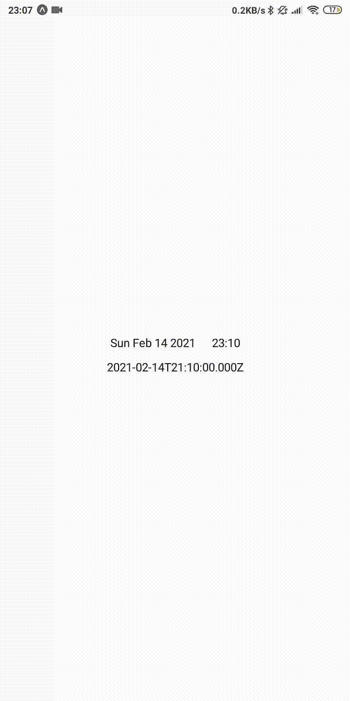
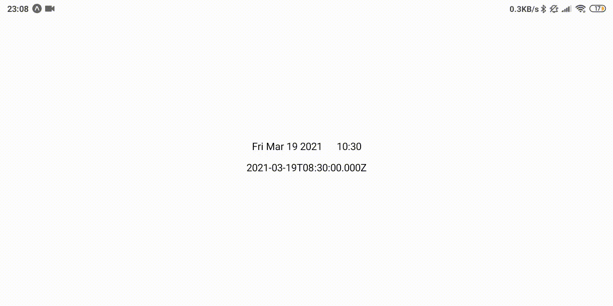

<h1>
RN DateTime
 

</h1>

Platform agnostic date & time pickers for React Native.
This project has been tested with Expo on iOS and Android.
Support for React Native Web is currently minimal.

These are simple implementations written in Typescript that mimic Google Calendar's date & time pickers.

This project also includes
[NaiveDate](https://github.com/rasmusmerzin/rn-datetime/blob/main/src/NaiveDate.ts) &
[NaiveTime](https://github.com/rasmusmerzin/rn-datetime/blob/main/src/NaiveTime.ts) types
which do not include timezone and can be converted into ES Date type (inheriting local timezone).

## Demos

> These demos are recorded in GMT+02:00.

## Installation

Add this package to a React Native project with

- `expo install rn-datetime` or
- `yarn add rn-datetime` or
- `npm install rn-datetime`

For usage check [`example`](https://github.com/rasmusmerzin/rn-datetime/blob/main/example) directory.
